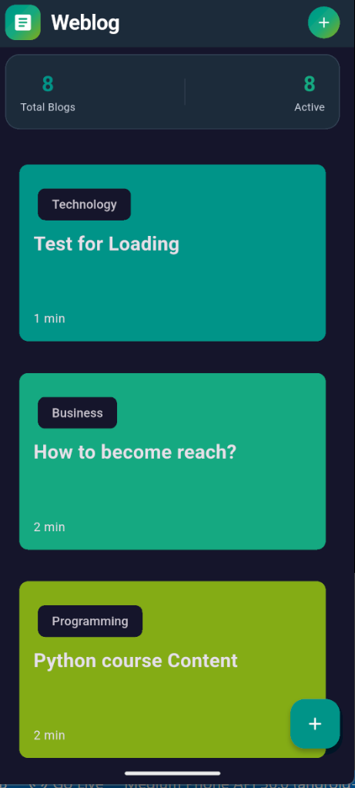
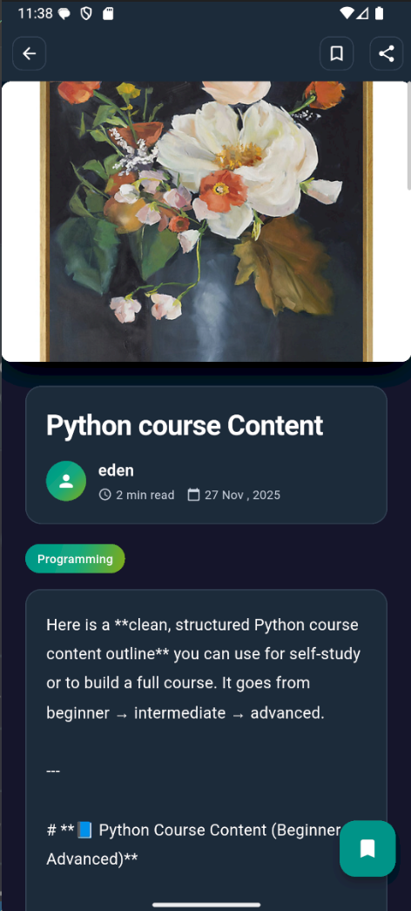

# 📱 Flutter App (Supabase • Hive • BLoC • GetIt)

A modern Flutter application using **Supabase** for backend services, **Hive** for offline storage, **BLoC** for state management, and **GetIt** for dependency injection — built with scalable Clean Architecture.

---

## 🚀 Features

* 🔐 Supabase Authentication & Database
* 🗄️ Offline-first caching with Hive
* 🧠 BLoC for predictable state management
* 🧩 GetIt for dependency injection
* ⚡ Clean, modular project structure

---

## 📂 Architecture

```
lib/
 ├── core/
 ├── features/
 │    └── <feature>/
 │         ├── data/
 │         ├── domain/
 │         └── presentation/
 ├── service_locator.dart
 └── main.dart
```

---

## ⚙️ Setup

### 1. Install dependencies

```bash
flutter pub get
```

### 2. Configure Supabase

Add your credentials:

```dart
await Supabase.initialize(
  url: 'YOUR_URL',
  anonKey: 'YOUR_KEY',
);
```

### 3. Initialize Hive

```dart
await Hive.initFlutter();
Hive.registerAdapter(YourModelAdapter());
```

### 4. Register dependencies (GetIt)

```dart
sl.registerLazySingleton(() => Supabase.instance.client);
sl.registerFactory(() => YourBloc(sl()));
```

---

## ▶️ Run

```bash
flutter run
```

---

## 🧪 Test

```bash
flutter test
```

---

## 📦 Build

```bash
flutter build apk --release
```

---

## Screenshots

### Signup Page


### Login Page


### Home Page


### Add blog Page


### View blog Page



